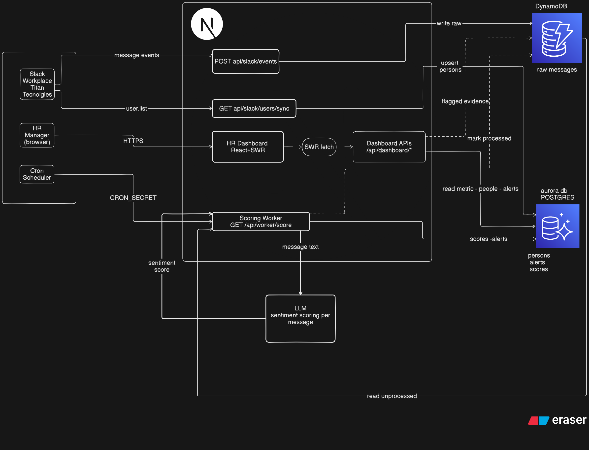

# Ember

Ember helps HR and People Ops spot workplace tension early by watching how teams communicate in Slack. It turns message patterns into risk scores and alerts — without dumping raw chat logs on the main dashboard.

**Tagline:** Protect your culture with signals, not surveys.

## What it does

1. **Listens** — Slack sends message events to Ember when the bot is in a channel.
2. **Scores** — A background worker reads new messages, runs sentiment analysis (OpenRouter with a local fallback), and combines four behavioral signals into a 0–10 risk score per person.
3. **Surfaces** — The dashboard shows metrics, an org risk map, alerts, and per-person breakdowns. Flagged message evidence is only available on individual profile pages.

## Risk scoring (for judges)

Each Slack message is scored **-1.0 → +1.0** via OpenRouter (with a keyword fallback). Those scores feed four behavioral signals per person; a weighted blend produces a **0–10 composite risk score** and alert level.

| Signal | What it catches | Weight |
| --- | --- | --- |
| **Sentiment drift** | Tone dropping vs the prior 3 weeks, or hostile messages directed at the person | 40% (60% when < 7 days of history) |
| **After-hours activity** | Weekend/evening messages in the last 14 days | 20% |
| **Channel exclusion** | Slack channels the person stopped posting in (last 30 days vs prior month) | 25% |
| **Response drop** | Message volume down 50%+ vs their 30-day baseline | 15% |

| Composite score | Level | Dashboard meaning |
| --- | --- | --- |
| 0.0 – 2.9 | Normal | Healthy baseline |
| 3.0 – 4.9 | Watch | Early signal — monitor |
| 5.0 – 7.4 | Warning | Multiple indicators firing |
| 7.5 – 10.0 | Critical | Escalate to HR |

Implementation: `lib/scoring/` (sentiment, signals, composite).


## Architecture



<details>
<summary><strong>How it works, API routes &amp; stack</strong></summary>

### How it works

| Step | What happens |
| --- | --- |
| **1. Ingest** | Slack sends message events to `/api/slack/events`. Raw messages are stored in DynamoDB with `processed: false`. |
| **2. Score** | Cron calls `/api/worker/score`. The worker reads unprocessed messages, sends each to **OpenRouter LLM** for sentiment scoring (`lib/scoring/sentiment.ts`), combines that with rule-based signals, writes results to PostgreSQL, then marks DynamoDB messages processed. |
| **3. Sync** | `/api/slack/users/sync` pulls Slack profiles (name, email, title → department) into PostgreSQL `persons`. |
| **4. Dashboard** | HR opens the React dashboard. APIs read PostgreSQL for metrics, people, and alerts. Person detail pages also read flagged message evidence from DynamoDB. |

### API routes

| Route | Purpose |
| --- | --- |
| `POST /api/slack/events` | Receive Slack Events API payloads |
| `GET /api/slack/users/sync` | Sync Slack users → PostgreSQL persons |
| `GET /api/worker/score` | Cron-triggered scoring (protected by `CRON_SECRET`) |
| `GET /api/worker/trigger` | Manual scoring trigger |
| `GET /api/dashboard/metrics` | Dashboard headline stats |
| `GET /api/dashboard/people` | Employee list + risk scores |
| `GET /api/dashboard/people/[id]` | Person detail + message evidence |
| `GET /api/dashboard/alerts` | Active alerts |
| `GET /api/dashboard/relationships` | Relationship graph data |

### Stack

| Layer | Tech |
| --- | --- |
| Frontend | Next.js 16, React, SWR, Tailwind, shadcn/ui |
| API | Next.js Route Handlers on Vercel |
| Raw events | AWS DynamoDB |
| Structured data | Aurora PostgreSQL + Drizzle ORM |
| Source | Slack Events API + users.list |
| Scheduler | Vercel Cron (daily) or cron-job.org (5 min) |
| AI / LLM | OpenRouter (`OPENROUTER_API_KEY`) — sentiment per message |

</details>

## Prerequisites

- Node.js 20+
- AWS account (DynamoDB table + Aurora PostgreSQL)
- Slack app with bot token and signing secret
- OpenRouter API key
- ngrok — only for local Slack webhook testing

## Quick start

```bash
cp .env.example .env.local   # fill in values
npm install
npm run db:migrate           # needs DATABASE_URL
npm run dev
```

Open [http://localhost:3000](http://localhost:3000) for the landing page, or `/dashboard` for the app.

### Environment variables


| Variable                                      | What it's for                                                      |
| --------------------------------------------- | ------------------------------------------------------------------ |
| `SLACK_BOT_TOKEN`                             | Bot OAuth token (`xoxb-...`)                                       |
| `SLACK_SIGNING_SECRET`                        | Slack request verification                                         |
| `AWS_ACCESS_KEY_ID` / `AWS_SECRET_ACCESS_KEY` | DynamoDB access                                                    |
| `AWS_REGION`                                  | e.g. `us-east-1`                                                   |
| `DYNAMODB_TABLE_NAME`                         | e.g. `ember-events`                                                |
| `DATABASE_URL`                                | Aurora Postgres connection string (`?sslmode=require`)             |
| `OPENROUTER_API_KEY`                          | Sentiment API key                                                  |
| `OPENROUTER_MODEL`                            | e.g. `openrouter/auto`                                             |
| `NEXT_PUBLIC_APP_URL`                         | Public URL (OpenRouter attribution)                                |
| `CRON_SECRET`                                 | Protects `/api/worker/*` routes                                    |
| `NEXT_PUBLIC_CRON_SECRET`                     | Optional — powers the ⚡ demo trigger button in dev or `?demo=true` |


Never commit `.env.local`.

## Slack setup

**Local (ngrok):**

1. `npm run dev` and `ngrok http 3000`
2. Slack app → Event Subscriptions → `https://YOUR-NGROK-URL/api/slack/events`
3. Subscribe to: `message.channels`, `message.groups`, `message.im`, `message.mpim`, `member_joined_channel`, `member_left_channel`
4. `/invite @Ember` in test channels

**Production:** same steps, but use your Vercel domain instead of ngrok.

After connecting, sync Slack users into the database:

```bash
curl https://YOUR_DOMAIN/api/slack/users/sync
```

## Scoring worker

Ember processes unprocessed DynamoDB messages in batches and writes scores to Postgres.

**Manual trigger** (handy for demos):

```bash
curl -H "Authorization: Bearer YOUR_CRON_SECRET" https://YOUR_DOMAIN/api/worker/trigger
```

In development (or production with `?demo=true`), a small ⚡ button in the bottom-right corner does the same thing — if `NEXT_PUBLIC_CRON_SECRET` is set.

**Scheduled runs:** Vercel Hobby only allows one cron job per day. This repo uses that slot for a daily sweep at 06:00 UTC (`vercel.json`). For fresher scores (~every 5 minutes), set up a free external cron (e.g. [cron-job.org](https://cron-job.org)) hitting:

```
GET https://YOUR_DOMAIN/api/worker/score?secret=YOUR_CRON_SECRET
```

## Deploy to Vercel

1. Push to GitHub and import the repo in Vercel
2. Add all env vars from `.env.example` (Production environment)
3. Point Slack Event Subscriptions to `https://YOUR_DOMAIN/api/slack/events`
4. Run user sync + a manual score trigger to verify
5. Set up external cron if you want sub-daily scoring on Hobby

Use **npm** only (`package-lock.json`). Do not commit a stale `pnpm-lock.yaml`.

## Demo / hackathon notes

- Single workspace: `org_id = "demo-org"` is hardcoded
- Landing page preview shows sample Titan Technologies data
- Message text is only exposed on `/people/[personId]` evidence views
- Settings page toggles are UI-only for now (not persisted)

